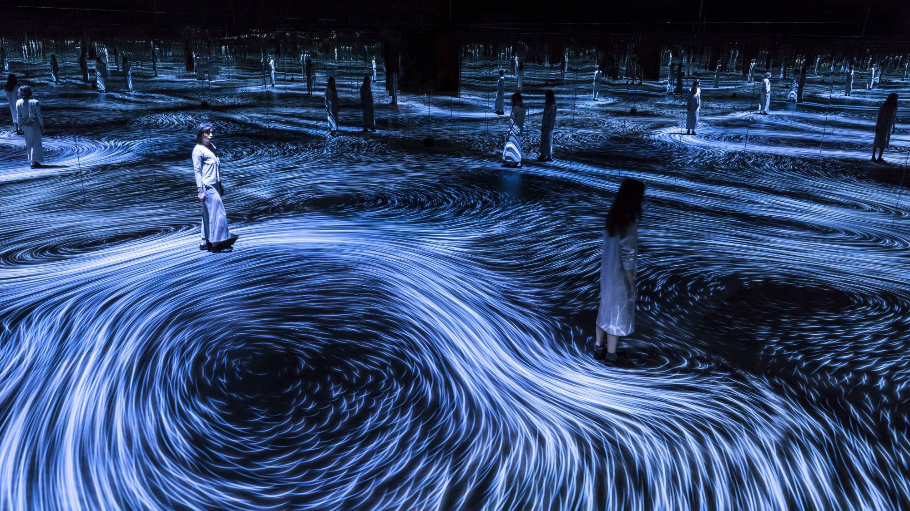
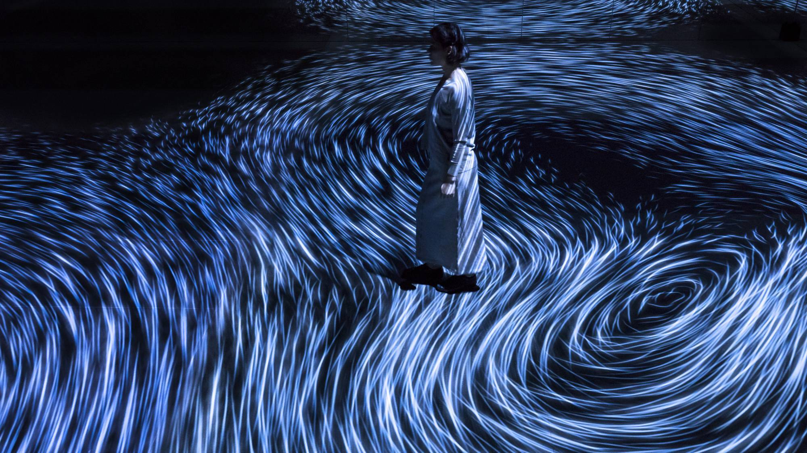

# ezha8129_9103_tut4

# Quiz 8
### Part 1: Imaging Technique

#### 1. Identifying an imaging technique
An imaging technique that I find inspiring is the use of particle systems which is used by teaLab's installation titled "Moving Creates Vortices and Vortices Create Movement" (teamLab, 2017). When a person moves, a force is applied in that direction, resulting in a flow. The flow is represented as numerous particles (teamLab, 2017).

A video link to showcasing the installation can be found [here](https://youtu.be/HXI4IPcorSQ "Moving Creates Vortices and Vortices Create Movement").

#### 2. Why is it a beneficial technique for the assignment?
Particle systems can be interactive and responsive to user input. From the example shown, I'd like to incorporate the flow and interactive element of controlling the flow of particles. This adds a sense of dynamism and engagement which aligns with the assignment requirements to create an animated output. The interativity also creates a more immersive experience.

---

### Part 2: Coding Technique
#### 1. Identifying a coding technique
A coding technique that can be used to assist in implementing the imaging technique of particle system is Perlin Noise.

#### 2. How does this coding technique contribute to the desired effect?
Using Perlin Noise can help achieve the desired effect by introducing controlled randomness and motion to the particles in the system (Khan Academy, n.d.). The particles can move and flow in a way that appears natural and visually interesting.

#### 3. Example of coding technique in action
The screenshot below utilises Perlin Noise and particle system to generate the output so that the particles move in a uniform manner. 

The link for the example code and output can be found [here](https://openprocessing.org/sketch/723240 "Light Pool").

---
### References
Khan Academy. (n.d.). _Perlin noise_. https://www.khanacademy.org/computing/computer-programming/programming-natural-simulations/programming-noise/a/perlin-noise 

teamLab. (2017). _Moving Creates Vortices and Vortices Create Movement_. https://www.teamlab.art/w/vortices/
